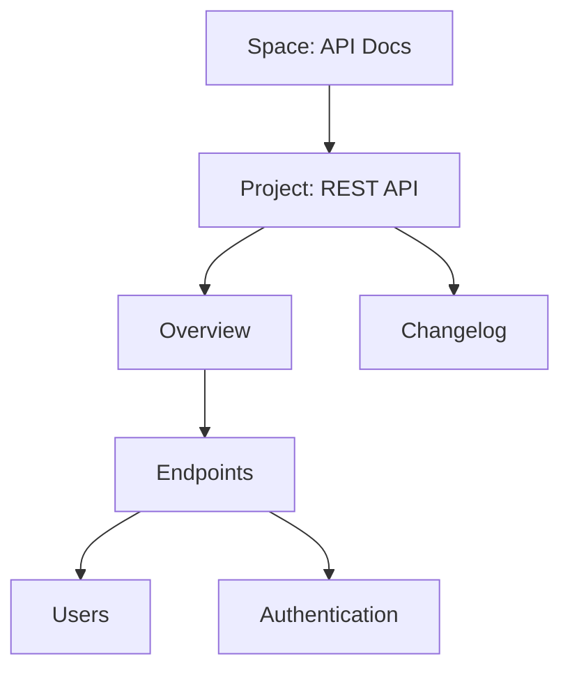

## Overview

Relevize organizes your documentation into structured spaces and projects. You build page hierarchies, collaborate with teams using granular permissions, and track changes through versioning. Master these concepts to create scalable documentation.

<Columns cols={2}>
  <Card title="Spaces & Projects" icon="layers" href="#spaces-projects">
    Group related documentation into isolated environments.
  </Card>
  <Card title="Page Hierarchy" icon="layout" href="#hierarchy">
    Nest pages for intuitive navigation and organization.
  </Card>
  <Card title="Collaboration" icon="users" href="#collaboration">
    Control access and workflows for teams.
  </Card>
  <Card title="Versioning" icon="git-branch" href="#versioning">
    Maintain history and rollback changes easily.
  </Card>
</Columns>

## Documentation Spaces and Projects

Spaces act as top-level containers for your documentation. Create separate spaces for products, teams, or initiatives. Within spaces, projects hold specific documentation sets, like API references or user guides.

<Steps>
  <Step title="Create a Space" icon="plus">
    Navigate to the Spaces dashboard and select `New Space`. Enter a name like `API Docs` and set visibility to `Private`.
  </Step>
  <Step title="Add a Project" icon="folder">
    Inside the space, click `New Project`. Choose a template such as `Developer Hub` for pre-built structures.
  </Step>
  <Step title="Import Content" icon="upload">
    Upload Markdown files or connect to GitHub for seamless syncing.
  </Step>
</Steps>

<Callout kind="tip">
  Use spaces for isolation—keep public marketing docs separate from internal engineering notes.
</Callout>

## Page Hierarchy and Organization

Build intuitive structures with nested pages. Top-level pages serve as landing pages, while children provide details.



Organize using frontmatter for metadata:

<CodeGroup tabs="MDX,YAML">
  ```mdx
  ---
  title: Authentication
  tags: ["security", "core"]
  ---
  ## Login Flow
  ```
  ```yaml
  title: Authentication
  tags:
    - security
    - core
  ```
</CodeGroup>

## Collaboration and Permissions

Invite team members and assign roles: `Viewer`, `Editor`, or `Admin`. Permissions cascade from spaces to pages.

<Tabs>
  <Tab title="Role Comparison" icon="users">
    
| Role     | View | Edit | Publish | Admin |
|----------|------|------|---------|-------|
| Viewer   | ✅   | ❌  | ❌     | ❌   |
| Editor   | ✅   | ✅  | ❌     | ❌   |
| Admin    | ✅   | ✅  | ✅     | ✅   |

  </Tab>
  <Tab title="Workflows" icon="git-merge">
    Enable pull requests for changes. Reviewers approve before publishing.
  </Tab>
</Tabs>

## Versioning and History

Relevize tracks every change with Git-like versioning. View diffs, restore previous versions, or branch for experiments.

<Expandable title="Advanced Versioning" default-open="false">

Access history via the page menu. Compare versions:

```bash
git diff v1.0 v1.1 -- docs/api.mdx
```

Set up automatic versioning on publish.

</Expandable>

<Callout kind="info">
  Enable versioning at the space level to apply it project-wide.
</Callout>