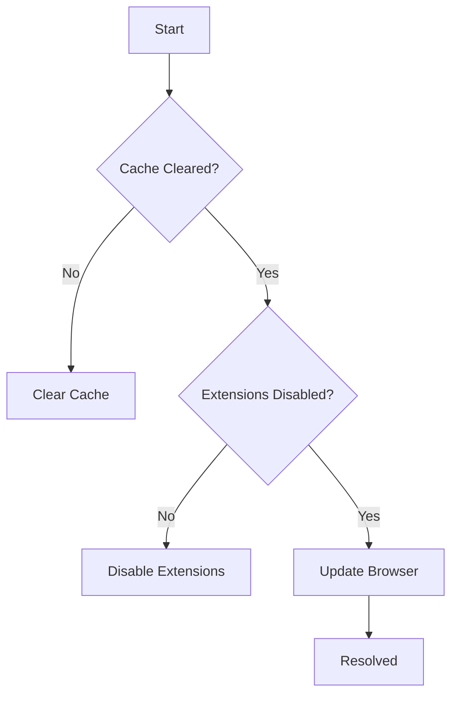

## Account and Access Issues

Encounter login failures or permission errors? Start here to regain access quickly.

<Callout kind="info">
  Always verify your email address and password first. Use the "Forgot Password" link if needed.
</Callout>

<Steps>
  <Step title="Clear Browser Cache" icon="trash-2">
    Persistent login issues often stem from cached data.

    <Tabs>
      <Tab title="Chrome" icon="chrome">
        ```bash
        chrome://settings/clearBrowserData
        ```
        Select "All time" and clear cookies/site data.
      </Tab>
      <Tab title="Firefox" icon="firefox">
        ```bash
        about:preferences#privacy
        ```
        Click "Clear Data" under Cookies and Site Data.
      </Tab>
    </Tabs>
  </Step>
  <Step title="Check Account Status" icon="user-check">
    Log in via incognito mode to bypass extensions.

    Visit `https://app.relevize.com/account` and review your subscription status.
  </Step>
  <Step title="Enable Two-Factor Authentication" icon="shield">
    Secure your account.

    ```javascript
    // In your profile settings
    enable2FA: true,
    backupCodes: ['code1', 'code2', 'code3']
    ```
  </Step>
</Steps>

## Editing and Formatting Problems

Struggling with Markdown rendering or content not saving? Follow these targeted fixes.

<CodeGroup tabs="Markdown,HTML">
  ```markdown
  ## Heading

  - List item with `inline code`
  - **Bold** and *italic* text
  ```
  ```html
  <h2>Heading</h2>
  <ul>
    <li><code>inline code</code></li>
    <li><strong>Bold</strong> and <em>italic</em></li>
  </ul>
  ```
</CodeGroup>

<Expandable title="Advanced Formatting Fixes" default-open="false">

If images fail to upload:

| Issue | Solution |
|-------|----------|
| Image too large | Resize to `<2MB` using tools like TinyPNG |
| Unsupported format | Convert to PNG or JPEG |
| Upload timeout | Check network; retry in smaller batches |

</Expandable>

<Callout kind="warning" kind="danger">
  Avoid raw HTML tags like `{<script>}` in Markdown pages, as they trigger security filters.
</Callout>

## Performance and Loading Errors

Slow page loads or editor freezes impact productivity. Optimize with these steps.



<Columns cols={2}>
  <Card title="Quick Performance Check" icon="zap" horizontal>
    Test page load time at `https://app.relevize.com/status`.
  </Card>
  <Card title="Network Diagnostics" icon="network">
    Run `ping app.relevize.com` in terminal.
  </Card>
</Columns>

## Contacting Support

Can't resolve the issue? Reach our team efficiently.

<Tabs>
  <Tab title="Submit Ticket" icon="mail">
    Use the in-app help center.

    1. Navigate to Settings > Support.
    2. Describe the error with screenshots.
    3. Include browser console logs:

    ```javascript
    console.error('Relevize Error:', { code: 500, message: 'Network failure' });
    ```

    Response time: `<4 hours` during business days.
  </Tab>
  <Tab title="Community Forum" icon="users">
    Search existing threads at `https://community.relevize.com`.

    Post new topics with tags like `bug`, `performance`.
  </Tab>
  <Tab title="Live Chat" icon="message-circle">
    Available 9AM-6PM EST.

    <Image
      src="https://example.com/chat-widget.png"
      alt="Live chat widget in Relevize dashboard"
      width="400"
      height="300"
    />
  </Tab>
</Tabs>

<Callout kind="success">
  Most issues resolve with cache clears or browser updates. Track your fixes in a personal log for future reference.
</Callout>